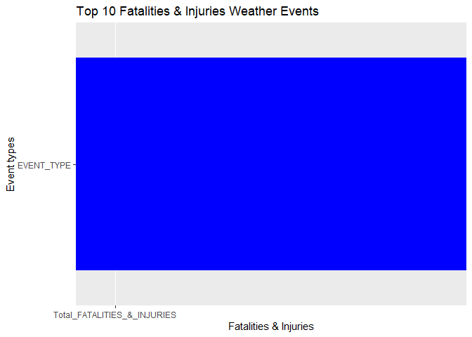
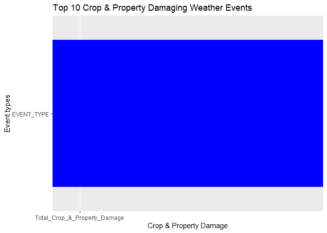

The platform specification used:

<table>
<thead>
<tr class="header">
<th>Spec</th>
<th>Description</th>
</tr>
</thead>
<tbody>
<tr class="odd">
<td>OS</td>
<td>Windows 10 Pro - 64 bit</td>
</tr>
<tr class="even">
<td>CPU</td>
<td>AMD Ryzen 5 - 3400G</td>
</tr>
<tr class="odd">
<td>RAM</td>
<td>16GB DDR4 3000MHz</td>
</tr>
<tr class="even">
<td>Storage</td>
<td>500GB SSD - M.2 NVMe (PCIe)</td>
</tr>
</tbody>
</table>

------------------------------------------------------------------------

Severe Weather Events in USA Impact on Health and Economy
---------------------------------------------------------

### Sypnosis

Storms and other severe weather events can cause both public health and
economic problems for communities and municipalities. Many severe events
can result in fatalities, injuries, and property damage, and preventing
such outcomes to the extent possible is a key concern.

The U.S. National Oceanic and Atmospheric Administration’s (NOAA) storm
database tracks characteristics of major storms and weather events in
the United States, including when and where they occur, as well as
estimates of any fatalities, injuries, and property damage.

The database between 1950 and 2011 can be downloaded at the following
link:
<a href="https://d396qusza40orc.cloudfront.net/repdata%2Fdata%2FStormData.csv.bz2" class="uri">https://d396qusza40orc.cloudfront.net/repdata%2Fdata%2FStormData.csv.bz2</a>

An additional database documentation on how some of the variables are
constructed/defined can be found here:
<a href="https://d396qusza40orc.cloudfront.net/repdata%2Fpeer2_doc%2Fpd01016005curr.pdf" class="uri">https://d396qusza40orc.cloudfront.net/repdata%2Fpeer2_doc%2Fpd01016005curr.pdf</a>

This report will use the NOAA Storm Database to answer the following two
questions:

1.  Across the United States, which types of events are most harmful
    with respect to population health?

2.  Across the United States, which types of events have the greatest
    economic consequences?

The result with graphs and conclusion will be displayed in the last
part.

------------------------------------------------------------------------

### Data Processing

To process the data we will be dividing this section into three seperate
processes.

Firstly we will need to download the data directly from the link
provided. Once the data is downloaded we will look at the at different
variables needed to solve the two questions on the impact on health and
economy.

Secondly to solve the question on the health impact there are two
variables that we need to analyse namely FATALITIES and INJURIES. This
will be elaborated further in the processes below

Thirdly to solve the question on economic impact there are four
variables that we need to analyse namely CROPDMGEXP, CROPDMG, PROPDMGEXP
and PROPDMG. ‘CROPDMGEXP’ is the exponent values for ‘CROPDMG’ (crop
damage). In the same way, ‘PROPDMGEXP’ is the exponent values for
‘PROPDMG’ (property damage). Both are needed to get the total values for
crops and property damage. (B or b = Billion, M or m = Million, K or k =
Thousand, H or h = Hundred). This will be elaborated further in the
processes below

#### Part 1:

-   Download data from the link provided in the sypnosis.
-   Read csv bz2 file and assign it to variable named data.
-   Use Dim function to check the number of observation and variables.

<!-- -->

    ## Set the URL
    url <- 'https://d396qusza40orc.cloudfront.net/repdata%2Fdata%2FStormData.csv.bz2'  

    ## Download the file and checked that the bz2 file is 46.8 MB (49,177,144 bytes) according to the info in week 4 forum discussion.
    download.file(url, destfile='repdata-data-StormData.csv.bz2', mode='wb')  

    ## Read the csv bz file and assign to data.
    rawData <- read.csv("repdata-data-StormData.csv.bz2", header = TRUE, sep = ",", na.strings = "NA")

    ## Look at the total number of observations and variables whether it is the same as the Week 4 Forum discussion which is 902297 records and 37 variables.
    dim(rawData)

\[1\] 902297 37

**Based on the raw data downloaded there are 902297 observations and 37
variables.**

------------------------------------------------------------------------

As there are close to a million observations in the raw data, it is
important that we do not waste any unnecessary resources to process the
data.Therefore we will need to Prepare only the relevant data to answer
the questions on health and economic impact.

    ## Create a Subset of FATALITIES or INJURIES data that contains more than 0.
    healthData <- rawData[(rawData$FATALITIES >0) | (rawData$INJURIES > 0),] 
    dim(healthData)

\[1\] 21929 37

    ## Create a Subset of CROPDMG or PROPDMG data that contains more than 0.
    economicData <- rawData[(rawData$CROPDMG > 0) | (rawData$PROPDMG > 0),]
    dim(economicData)

\[1\] 245031 37

**The relevant health data contains 21929 observations and 37 variables
where as the relevant economic data contains 245031 observations and 37
variables.**

------------------------------------------------------------------------

#### Part 2:

-   Use the Aggregate and CBIND function to get the total number of
    FATALITIES and INJURIES based on the EVTYPE.
-   Sum up the FATALITIES + INJURIES based on the EVTYPE.
-   Use the MERGE function to combine these two data together.

<!-- -->

    ## Using Aggregate and CBIND to sum the total FATALITIES and INJURIES based on EVTYPE and assign it to fatInj
    fatInj <- aggregate(cbind(FATALITIES,INJURIES)~EVTYPE,data = healthData, FUN = sum, na.rm = TRUE)

    ## Assign the column with names for the new table.
    names(fatInj) <- c("EVENT_TYPE", "FATALITIES", "INJURIES")

    ## Rank the top INJURIES based on EVTYPE
    injuriesRank <- fatInj[order(-fatInj$INJURIES), ]

    ## Rank the top FATALITIES based on EVTYPE
    fatalitiesRank <- fatInj[order(-fatInj$FATALITIES), ]

    ## Top 10 INJURIES causing EVTYPE
    topInjuries <- kable(injuriesRank[1:10,])
    topInjuries

<table>
<thead>
<tr class="header">
<th></th>
<th style="text-align: left;">EVENT_TYPE</th>
<th style="text-align: right;">FATALITIES</th>
<th style="text-align: right;">INJURIES</th>
</tr>
</thead>
<tbody>
<tr class="odd">
<td>184</td>
<td style="text-align: left;">TORNADO</td>
<td style="text-align: right;">5633</td>
<td style="text-align: right;">91346</td>
</tr>
<tr class="even">
<td>191</td>
<td style="text-align: left;">TSTM WIND</td>
<td style="text-align: right;">504</td>
<td style="text-align: right;">6957</td>
</tr>
<tr class="odd">
<td>47</td>
<td style="text-align: left;">FLOOD</td>
<td style="text-align: right;">470</td>
<td style="text-align: right;">6789</td>
</tr>
<tr class="even">
<td>32</td>
<td style="text-align: left;">EXCESSIVE HEAT</td>
<td style="text-align: right;">1903</td>
<td style="text-align: right;">6525</td>
</tr>
<tr class="odd">
<td>123</td>
<td style="text-align: left;">LIGHTNING</td>
<td style="text-align: right;">816</td>
<td style="text-align: right;">5230</td>
</tr>
<tr class="even">
<td>69</td>
<td style="text-align: left;">HEAT</td>
<td style="text-align: right;">937</td>
<td style="text-align: right;">2100</td>
</tr>
<tr class="odd">
<td>117</td>
<td style="text-align: left;">ICE STORM</td>
<td style="text-align: right;">89</td>
<td style="text-align: right;">1975</td>
</tr>
<tr class="even">
<td>42</td>
<td style="text-align: left;">FLASH FLOOD</td>
<td style="text-align: right;">978</td>
<td style="text-align: right;">1777</td>
</tr>
<tr class="odd">
<td>173</td>
<td style="text-align: left;">THUNDERSTORM WIND</td>
<td style="text-align: right;">133</td>
<td style="text-align: right;">1488</td>
</tr>
<tr class="even">
<td>67</td>
<td style="text-align: left;">HAIL</td>
<td style="text-align: right;">15</td>
<td style="text-align: right;">1361</td>
</tr>
</tbody>
</table>

    ## Top 10 FATALITIES causing EVTYPE
    topFatalities <- kable(fatalitiesRank[1:10,])
    topFatalities

<table>
<thead>
<tr class="header">
<th></th>
<th style="text-align: left;">EVENT_TYPE</th>
<th style="text-align: right;">FATALITIES</th>
<th style="text-align: right;">INJURIES</th>
</tr>
</thead>
<tbody>
<tr class="odd">
<td>184</td>
<td style="text-align: left;">TORNADO</td>
<td style="text-align: right;">5633</td>
<td style="text-align: right;">91346</td>
</tr>
<tr class="even">
<td>32</td>
<td style="text-align: left;">EXCESSIVE HEAT</td>
<td style="text-align: right;">1903</td>
<td style="text-align: right;">6525</td>
</tr>
<tr class="odd">
<td>42</td>
<td style="text-align: left;">FLASH FLOOD</td>
<td style="text-align: right;">978</td>
<td style="text-align: right;">1777</td>
</tr>
<tr class="even">
<td>69</td>
<td style="text-align: left;">HEAT</td>
<td style="text-align: right;">937</td>
<td style="text-align: right;">2100</td>
</tr>
<tr class="odd">
<td>123</td>
<td style="text-align: left;">LIGHTNING</td>
<td style="text-align: right;">816</td>
<td style="text-align: right;">5230</td>
</tr>
<tr class="even">
<td>191</td>
<td style="text-align: left;">TSTM WIND</td>
<td style="text-align: right;">504</td>
<td style="text-align: right;">6957</td>
</tr>
<tr class="odd">
<td>47</td>
<td style="text-align: left;">FLOOD</td>
<td style="text-align: right;">470</td>
<td style="text-align: right;">6789</td>
</tr>
<tr class="even">
<td>147</td>
<td style="text-align: left;">RIP CURRENT</td>
<td style="text-align: right;">368</td>
<td style="text-align: right;">232</td>
</tr>
<tr class="odd">
<td>93</td>
<td style="text-align: left;">HIGH WIND</td>
<td style="text-align: right;">248</td>
<td style="text-align: right;">1137</td>
</tr>
<tr class="even">
<td>2</td>
<td style="text-align: left;">AVALANCHE</td>
<td style="text-align: right;">224</td>
<td style="text-align: right;">170</td>
</tr>
</tbody>
</table>

    ## Using Aggregate function to sum the FATALITIES + INJURIES based on EVTYPE and assign it to totalImpact
    totalImpact <- aggregate((FATALITIES + INJURIES) ~ EVTYPE, data = healthData, FUN = sum, na.rm = TRUE)

    ## Assign the column with name the new table of the total FATALITIES and INJURIES combined.
    names(totalImpact) <- c("EVENT_TYPE", "Total_FATALITIES_&_INJURIES")

    totalImpact = totalImpact[order(-totalImpact$`Total_FATALITIES_&_INJURIES`), ]

    ## Using the Merge function to combine the two data together to show the health impact
    healthImpact <- merge(fatInj, totalImpact)

    ## Rank the top health impact on the new combined data
    healthImpact <- healthImpact[order(-healthImpact$`Total_FATALITIES_&_INJURIES`), ]

    ## Top 10 Total Health Impact (FATALITIES + INJURIES) causing EVTYPE
    topHealthImpact <- kable(healthImpact[1:10,])

    ## Please go to the Result section to look at the top 10 health impact based on EVTYPE.

    healthPlot <- ggplot(totalImpact[1:10, ], aes(x= reorder('EVENT_TYPE', 'Total_FATALITIES_&_INJURIES'), y='Total_FATALITIES_&_INJURIES')) + geom_bar(stat = "identity",fill="blue") + coord_flip() + labs(x = "Event types", y = "Fatalities & Injuries", title = "Top 10 Fatalities & Injuries Weather Events")

    healthPlot

    ## Warning in mean.default(X[[i]], ...): argument is not numeric or logical:
    ## returning NA

    ## Warning in mean.default(X[[i]], ...): argument is not numeric or logical:
    ## returning NA

------------------------------------------------------------------------

#### Part 3:

-   Convert exponent value DMGEXP of both the crop and property for
    total damage comparison
-   Use the Aggregate and CBIND function to get the total number of the
    converted damage of both crop and property based on the EVTYPE.
-   Combine both the new crop and property damage to assess the total
    economic impact

<!-- -->

    ## Retrieving values of exponents 
    expData <- economicData[economicData$PROPDMGEXP %in% c("", "K", "M", "B") & economicData$CROPDMGEXP %in% c("", "K", "M", "B"), ]

    ## Create function to convert exponent values to calculate total damages using DMG * Exponent
    convExponent <- function(dmg, exp) {
        if (exp == "K") {
            dmg * 1000
        } else if (exp == "M") {
            dmg * 10^6
        } else if (exp == "B") {
            dmg * 10^9
        } else if (exp == "") {
            dmg
        } else {
            stop("NOT VALID DATA")
        }
    }

    ## Using MAPPLY function to get the new property damage value in million dollars value
    expData$PROP_DMG <- mapply(convExponent, expData$PROPDMG, expData$PROPDMGEXP)/10^6

    ## Using MAPPLY function to get the new crop damage value in million dollar value
    expData$CROP_DMG <- mapply(convExponent, expData$CROPDMG, expData$CROPDMGEXP)/10^6

    ## Using Aggregate and CBIND to sum the total property and crop damage based on EVTYPE
    cropProp <- aggregate(cbind(expData$PROP_DMG, expData$CROP_DMG)~EVTYPE,data = expData, FUN = sum, na.rm = TRUE)

    ## Assign the column with names for the new table.
    names(cropProp) <- c("EVENT_TYPE", "Property Damage in $million", "Crop Damage in $million")

    ## Rank the top crop damage based on EVTYPE
    cropRank <- cropProp[order(-cropProp$'Crop Damage'), ]
    topCrop <- kable(cropRank[1:10,])
    topCrop

<table>
<thead>
<tr class="header">
<th></th>
<th style="text-align: left;">EVENT_TYPE</th>
<th style="text-align: right;">Property Damage in $million</th>
<th style="text-align: right;">Crop Damage in $million</th>
</tr>
</thead>
<tbody>
<tr class="odd">
<td>38</td>
<td style="text-align: left;">DROUGHT</td>
<td style="text-align: right;">1046.1060</td>
<td style="text-align: right;">13972.566</td>
</tr>
<tr class="even">
<td>70</td>
<td style="text-align: left;">FLOOD</td>
<td style="text-align: right;">144657.7098</td>
<td style="text-align: right;">5661.968</td>
</tr>
<tr class="odd">
<td>257</td>
<td style="text-align: left;">RIVER FLOOD</td>
<td style="text-align: right;">5118.9455</td>
<td style="text-align: right;">5029.459</td>
</tr>
<tr class="even">
<td>201</td>
<td style="text-align: left;">ICE STORM</td>
<td style="text-align: right;">3944.9278</td>
<td style="text-align: right;">5022.110</td>
</tr>
<tr class="odd">
<td>113</td>
<td style="text-align: left;">HAIL</td>
<td style="text-align: right;">15727.1658</td>
<td style="text-align: right;">3000.537</td>
</tr>
<tr class="even">
<td>184</td>
<td style="text-align: left;">HURRICANE</td>
<td style="text-align: right;">11868.3190</td>
<td style="text-align: right;">2741.910</td>
</tr>
<tr class="odd">
<td>192</td>
<td style="text-align: left;">HURRICANE/TYPHOON</td>
<td style="text-align: right;">69305.8400</td>
<td style="text-align: right;">2607.873</td>
</tr>
<tr class="even">
<td>58</td>
<td style="text-align: left;">FLASH FLOOD</td>
<td style="text-align: right;">16140.8117</td>
<td style="text-align: right;">1420.727</td>
</tr>
<tr class="odd">
<td>53</td>
<td style="text-align: left;">EXTREME COLD</td>
<td style="text-align: right;">67.7374</td>
<td style="text-align: right;">1292.973</td>
</tr>
<tr class="even">
<td>95</td>
<td style="text-align: left;">FROST/FREEZE</td>
<td style="text-align: right;">9.4800</td>
<td style="text-align: right;">1094.086</td>
</tr>
</tbody>
</table>

    ## Rank the top property damage based on EVTYPE
    propRank <- cropProp[order(-cropProp$'Property Damage'), ]
    topProp <- kable(propRank[1:10,])
    topProp

<table>
<thead>
<tr class="header">
<th></th>
<th style="text-align: left;">EVENT_TYPE</th>
<th style="text-align: right;">Property Damage in $million</th>
<th style="text-align: right;">Crop Damage in $million</th>
</tr>
</thead>
<tbody>
<tr class="odd">
<td>70</td>
<td style="text-align: left;">FLOOD</td>
<td style="text-align: right;">144657.710</td>
<td style="text-align: right;">5661.9685</td>
</tr>
<tr class="even">
<td>192</td>
<td style="text-align: left;">HURRICANE/TYPHOON</td>
<td style="text-align: right;">69305.840</td>
<td style="text-align: right;">2607.8728</td>
</tr>
<tr class="odd">
<td>348</td>
<td style="text-align: left;">TORNADO</td>
<td style="text-align: right;">56925.485</td>
<td style="text-align: right;">364.9501</td>
</tr>
<tr class="even">
<td>294</td>
<td style="text-align: left;">STORM SURGE</td>
<td style="text-align: right;">43323.536</td>
<td style="text-align: right;">0.0050</td>
</tr>
<tr class="odd">
<td>58</td>
<td style="text-align: left;">FLASH FLOOD</td>
<td style="text-align: right;">16140.812</td>
<td style="text-align: right;">1420.7271</td>
</tr>
<tr class="even">
<td>113</td>
<td style="text-align: left;">HAIL</td>
<td style="text-align: right;">15727.166</td>
<td style="text-align: right;">3000.5375</td>
</tr>
<tr class="odd">
<td>184</td>
<td style="text-align: left;">HURRICANE</td>
<td style="text-align: right;">11868.319</td>
<td style="text-align: right;">2741.9100</td>
</tr>
<tr class="even">
<td>357</td>
<td style="text-align: left;">TROPICAL STORM</td>
<td style="text-align: right;">7703.891</td>
<td style="text-align: right;">678.3460</td>
</tr>
<tr class="odd">
<td>418</td>
<td style="text-align: left;">WINTER STORM</td>
<td style="text-align: right;">6688.497</td>
<td style="text-align: right;">26.9440</td>
</tr>
<tr class="even">
<td>170</td>
<td style="text-align: left;">HIGH WIND</td>
<td style="text-align: right;">5270.046</td>
<td style="text-align: right;">638.5713</td>
</tr>
</tbody>
</table>

    ## Using Aggregate function to sum the 'CROP Damage' + 'Property Damage' based on EVTYPE and assign it to totalImpact
    totalEconomic <- aggregate((expData$PROP_DMG + expData$CROP_DMG) ~ EVTYPE, data = expData, FUN = sum, na.rm = TRUE)

    ## Assign the column with name the new table of the total FATALITIES and INJURIES combined.
    names(totalEconomic) <- c("EVENT_TYPE", "Total_Crop_&_Property_Damage")

    ## Using the Merge function to combine the two economic data together to show the economic impact
    economicImpact <- merge(cropProp, totalEconomic)

    ## Rank the top economic impact on the new combined data
    economicImpactRank <- economicImpact[order(-economicImpact$'Total_Crop_&_Property_Damage'), ]

    ## Top 10 Total Health Impact (CROP + PROPERTY DAMAGE) causing EVTYPE
    topEconomicImpact <- kable(economicImpactRank[1:10, ])

    ## Please go to the Result section to look at the top 10 economic impact based on EVTYPE.

    economyPlot <- ggplot(economicImpact[1:10, ], aes(x= reorder('EVENT_TYPE', 'Total_Crop_&_Property_Damage'), y='Total_Crop_&_Property_Damage')) + geom_bar(stat = "identity",fill="blue") + coord_flip() + labs(x = "Event types", y = "Crop & Property Damage", title = "Top 10 Crop & Property Damaging Weather Events")

    economyPlot

    ## Warning in mean.default(X[[i]], ...): argument is not numeric or logical:
    ## returning NA

    ## Warning in mean.default(X[[i]], ...): argument is not numeric or logical:
    ## returning NA

------------------------------------------------------------------------

### Results

This is based on the data collected from U.S. National Oceanic and
Atmospheric Administration’s (NOAA) storm database between 1950 and
2011.

 

##### Question 1: Across the United States, which types of events are most harmful with respect to population health?

**ANS: **   **The following table and plot will show you the top 10
event type that are most harmful to the population health.**

<table>
<thead>
<tr class="header">
<th></th>
<th style="text-align: left;">EVENT_TYPE</th>
<th style="text-align: right;">FATALITIES</th>
<th style="text-align: right;">INJURIES</th>
<th style="text-align: right;">Total_FATALITIES_&amp;_INJURIES</th>
</tr>
</thead>
<tbody>
<tr class="odd">
<td>184</td>
<td style="text-align: left;">TORNADO</td>
<td style="text-align: right;">5633</td>
<td style="text-align: right;">91346</td>
<td style="text-align: right;">96979</td>
</tr>
<tr class="even">
<td>32</td>
<td style="text-align: left;">EXCESSIVE HEAT</td>
<td style="text-align: right;">1903</td>
<td style="text-align: right;">6525</td>
<td style="text-align: right;">8428</td>
</tr>
<tr class="odd">
<td>191</td>
<td style="text-align: left;">TSTM WIND</td>
<td style="text-align: right;">504</td>
<td style="text-align: right;">6957</td>
<td style="text-align: right;">7461</td>
</tr>
<tr class="even">
<td>47</td>
<td style="text-align: left;">FLOOD</td>
<td style="text-align: right;">470</td>
<td style="text-align: right;">6789</td>
<td style="text-align: right;">7259</td>
</tr>
<tr class="odd">
<td>123</td>
<td style="text-align: left;">LIGHTNING</td>
<td style="text-align: right;">816</td>
<td style="text-align: right;">5230</td>
<td style="text-align: right;">6046</td>
</tr>
<tr class="even">
<td>69</td>
<td style="text-align: left;">HEAT</td>
<td style="text-align: right;">937</td>
<td style="text-align: right;">2100</td>
<td style="text-align: right;">3037</td>
</tr>
<tr class="odd">
<td>42</td>
<td style="text-align: left;">FLASH FLOOD</td>
<td style="text-align: right;">978</td>
<td style="text-align: right;">1777</td>
<td style="text-align: right;">2755</td>
</tr>
<tr class="even">
<td>117</td>
<td style="text-align: left;">ICE STORM</td>
<td style="text-align: right;">89</td>
<td style="text-align: right;">1975</td>
<td style="text-align: right;">2064</td>
</tr>
<tr class="odd">
<td>173</td>
<td style="text-align: left;">THUNDERSTORM WIND</td>
<td style="text-align: right;">133</td>
<td style="text-align: right;">1488</td>
<td style="text-align: right;">1621</td>
</tr>
<tr class="even">
<td>214</td>
<td style="text-align: left;">WINTER STORM</td>
<td style="text-align: right;">206</td>
<td style="text-align: right;">1321</td>
<td style="text-align: right;">1527</td>
</tr>
</tbody>
</table>

------------------------------------------------------------------------

##### Question 2: Across the United States, which types of events have the greatest economic consequences?

**ANS: **   **The following table and plot will show you the top 10
event type that has the greatest economic consequences.**

<table>
<thead>
<tr class="header">
<th></th>
<th style="text-align: left;">EVENT_TYPE</th>
<th style="text-align: right;">Property Damage in $million</th>
<th style="text-align: right;">Crop Damage in $million</th>
<th style="text-align: right;">Total_Crop_&amp;_Property_Damage</th>
</tr>
</thead>
<tbody>
<tr class="odd">
<td>70</td>
<td style="text-align: left;">FLOOD</td>
<td style="text-align: right;">144657.710</td>
<td style="text-align: right;">5661.9685</td>
<td style="text-align: right;">150319.678</td>
</tr>
<tr class="even">
<td>192</td>
<td style="text-align: left;">HURRICANE/TYPHOON</td>
<td style="text-align: right;">69305.840</td>
<td style="text-align: right;">2607.8728</td>
<td style="text-align: right;">71913.713</td>
</tr>
<tr class="odd">
<td>348</td>
<td style="text-align: left;">TORNADO</td>
<td style="text-align: right;">56925.485</td>
<td style="text-align: right;">364.9501</td>
<td style="text-align: right;">57290.436</td>
</tr>
<tr class="even">
<td>294</td>
<td style="text-align: left;">STORM SURGE</td>
<td style="text-align: right;">43323.536</td>
<td style="text-align: right;">0.0050</td>
<td style="text-align: right;">43323.541</td>
</tr>
<tr class="odd">
<td>113</td>
<td style="text-align: left;">HAIL</td>
<td style="text-align: right;">15727.166</td>
<td style="text-align: right;">3000.5375</td>
<td style="text-align: right;">18727.703</td>
</tr>
<tr class="even">
<td>58</td>
<td style="text-align: left;">FLASH FLOOD</td>
<td style="text-align: right;">16140.812</td>
<td style="text-align: right;">1420.7271</td>
<td style="text-align: right;">17561.539</td>
</tr>
<tr class="odd">
<td>38</td>
<td style="text-align: left;">DROUGHT</td>
<td style="text-align: right;">1046.106</td>
<td style="text-align: right;">13972.5660</td>
<td style="text-align: right;">15018.672</td>
</tr>
<tr class="even">
<td>184</td>
<td style="text-align: left;">HURRICANE</td>
<td style="text-align: right;">11868.319</td>
<td style="text-align: right;">2741.9100</td>
<td style="text-align: right;">14610.229</td>
</tr>
<tr class="odd">
<td>257</td>
<td style="text-align: left;">RIVER FLOOD</td>
<td style="text-align: right;">5118.945</td>
<td style="text-align: right;">5029.4590</td>
<td style="text-align: right;">10148.405</td>
</tr>
<tr class="even">
<td>201</td>
<td style="text-align: left;">ICE STORM</td>
<td style="text-align: right;">3944.928</td>
<td style="text-align: right;">5022.1100</td>
<td style="text-align: right;">8967.038</td>
</tr>
</tbody>
</table>
